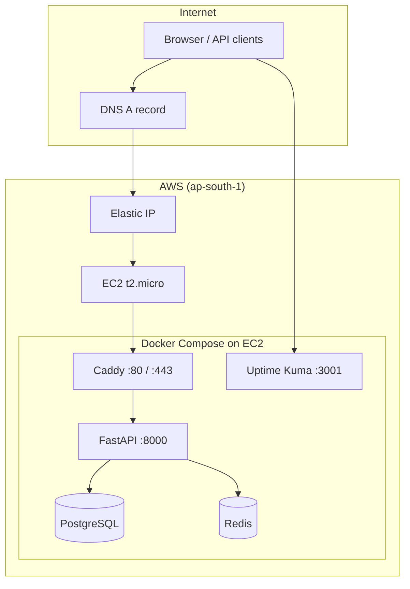

# StatusPulse

StatusPulse is a self-hosted status page and service monitoring stack. It runs on AWS EC2 with a stable Elastic IP, deploys via Terraform, and serves a FastAPI application behind Caddy with PostgreSQL, Redis, and Uptime Kuma.

## Features

- **Status API** — Register services, track health, and manage incidents (FastAPI + PostgreSQL)
- **Caching** — Redis-backed data layer
- **HTTPS** — Automatic TLS via Caddy (Let's Encrypt) for your configured domain
- **Uptime Kuma** — External uptime monitoring UI on port `3001`
- **Stable public IP** — AWS Elastic IP survives instance replacements
- **One-command bootstrap** — Provision infrastructure, sync code, and start containers

## Architecture



| Component    | Role                                      |
|-------------|-------------------------------------------|
| Terraform   | EC2, security group, Elastic IP, SSH key  |
| Userdata    | OS packages, Docker, firewall, swap       |
| Bootstrap   | Terraform apply + rsync + `docker-compose` |
| Caddy       | Reverse proxy + HTTPS                       |
| FastAPI     | Status page API                             |
| PostgreSQL  | Persistent service/incident data            |
| Redis       | Cache layer                                 |
| Uptime Kuma | Uptime dashboards                           |

## Project structure

```
statuspulse/
├── deploy/
│   ├── app/                 # FastAPI application
│   │   ├── main.py
│   │   └── requirements.txt
│   ├── docker-compose.yml   # Stack definition
│   ├── Dockerfile
│   ├── Caddyfile.tpl        # Caddy config template (__DOMAIN__ placeholder)
│   ├── .env.example         # Environment variable reference
│   └── .env                 # Local secrets (gitignored)
├── scripts/
│   ├── bootstrap.py         # Full provision + deploy (run this first)
│   ├── deploy.sh            # Redeploy on server (after SSH)
│   └── healthcheck.sh       # Curl public health endpoint
└── terraform/
    ├── main.tf              # EC2, EIP, security group, VPC lookup
    ├── variables.tf
    ├── terraform.tfvars     # Your environment values
    ├── userdata.sh.tpl      # First-boot OS setup
    └── outputs.tf
```

## Prerequisites

### Local machine

| Tool        | Purpose                          |
|------------|-----------------------------------|
| Python 3.9+| Run `bootstrap.py`                |
| Terraform  | Infrastructure                    |
| AWS CLI    | Credentials (`aws configure`)     |
| SSH key    | Default: `~/.ssh/id_ed25519`    |
| rsync      | Sync deploy bundle to server      |

Install Terraform (macOS):

```bash
brew install hashicorp/tap/terraform
```

### AWS

- An AWS account with credentials configured
- A VPC named **`Ajax-VPC`** (or change `vpc_name` in `terraform.tfvars`)
- At least one **public subnet** in that VPC (`map-public-ip-on-launch = true`)
- IAM permissions for EC2, Elastic IP, and key pairs

### DNS

Point your domain’s **A record** to the Elastic IP printed after bootstrap (`terraform output server_ip`).

Example: `statuspulse.example.com` → `3.x.x.x`

## Quick start

### 1. Configure Terraform

Edit `terraform/terraform.tfvars`:

```hcl
key_name        = "statuspulse-key"
public_key_path = "~/.ssh/id_ed25519.pub"
domain_name     = "statuspulse.example.com"
vpc_name        = "Ajax-VPC"
```

### 2. Configure application secrets (optional)

```bash
cp deploy/.env.example deploy/.env
# Edit passwords in deploy/.env
```

> **Note:** `docker-compose.yml` currently sets database env vars inline. Use `.env` as reference; wire `env_file` in compose if you want compose to load it.

### 3. Run bootstrap

```bash
cd scripts
python3 bootstrap.py
```

Bootstrap will:

1. Run `terraform init`, `fmt`, `validate`, `plan`, `apply`
2. Allocate an **Elastic IP** and attach it to the instance
3. Wait for SSH and cloud-init (apt, Docker, UFW, swap)
4. Rsync `deploy/` to `/opt/statuspulse/` on the server
5. Stop conflicting host services (e.g. system Caddy on port 80)
6. Run `docker-compose up -d --build` and verify `/health`

On success you’ll see:

```
Elastic IP:      3.x.x.x
Application URL: https://statuspulse.example.com
SSH:             ssh -i ~/.ssh/id_ed25519 ubuntu@3.x.x.x
```

### 4. Verify

```bash
curl https://statuspulse.umehta.xyz/health
# or
./scripts/healthcheck.sh
```

## Configuration reference

### Terraform variables (`terraform/terraform.tfvars`)

| Variable           | Description                          |
|-------------------|--------------------------------------|
| `key_name`        | AWS SSH key pair name                |
| `public_key_path` | Path to your `.pub` key (`~` expanded) |
| `domain_name`     | Domain for Caddy HTTPS + app URL       |
| `vpc_name`        | VPC `Name` tag (default: `Ajax-VPC`) |

Other defaults live in `terraform/variables.tf` (`aws_region`, `instance_type`, `ssh_user`).

### Terraform outputs

```bash
cd terraform
terraform output server_ip                  # Elastic IP
terraform output elastic_ip_allocation_id
terraform output app_url
terraform output domain_name
```

### Environment variables (`deploy/.env.example`)

| Variable          | Used by        |
|------------------|----------------|
| `DB_*`           | FastAPI app    |
| `REDIS_*`        | FastAPI app    |
| `POSTGRES_*`     | Postgres container |

## API

Base URL: `https://statuspulse.umehta.xyz`

| Method | Path          | Description              |
|--------|---------------|--------------------------|
| GET    | `/`           | Service info             |
| GET    | `/health`     | API, DB, and Redis check |
| GET    | `/services`   | List monitored services  |
| POST   | `/services`   | Register a service       |
| GET    | `/incidents`  | List incidents           |
| POST   | `/incidents`  | Create an incident       |

Interactive docs: `https://<your-domain>/docs`

## Updating the application

After changing code under `deploy/`:

**Option A — Re-run bootstrap** (runs Terraform again):

```bash
cd scripts && python3 bootstrap.py
```

**Option B — Deploy on server only** (faster):

```bash
rsync -rz --delete -e "ssh -i ~/.ssh/id_ed25519" \
  deploy/ ubuntu@<ELASTIC_IP>:/opt/statuspulse/

ssh -i ~/.ssh/id_ed25519 ubuntu@<ELASTIC_IP>
cd /opt/statuspulse && sudo ./deploy.sh  
```

Or use the remote deploy steps from `scripts/deploy.sh` (stop host Caddy, `docker-compose down`, `up --build`).

## Server layout

All runtime files live on the instance at:

```
/opt/statuspulse/
├── app/
├── Caddyfile          # Generated from Caddyfile.tpl + domain
├── docker-compose.yml
└── Dockerfile
```

## Security group ports

| Port  | Service     |
|-------|-------------|
| 22    | SSH         |
| 80    | HTTP (Caddy)|
| 443   | HTTPS       |
| 3001  | Uptime Kuma |

Restrict SSH (`22`) to your IP in production by editing `terraform/main.tf`.

## Troubleshooting

### `terraform` not found

Install Terraform and ensure it is on your `PATH` (see Prerequisites).

### `No default VPC` / VPC errors

This project targets a named VPC (`Ajax-VPC`). Set `vpc_name` in `terraform.tfvars` to match your VPC’s `Name` tag.

### Port 80 already in use

A **system Caddy** service may be running outside Docker. Bootstrap and `deploy.sh` stop/disable it automatically. Manual fix:

```bash
sudo systemctl stop caddy
sudo systemctl disable caddy
```

### `docker: unknown command: docker compose`

Ubuntu’s `docker.io` package uses **`docker-compose`** (hyphen). Scripts already use that form.

### rsync permission denied on `/opt/statuspulse`

Bootstrap runs `sudo chown -R ubuntu:ubuntu /opt/statuspulse` before sync. Re-run bootstrap or fix ownership on the server.

### HTTPS / certificate issues

- Confirm DNS A record points to the Elastic IP
- Allow a few minutes after first deploy for Let’s Encrypt
- Check Caddy logs: `sudo docker-compose -f /opt/statuspulse/docker-compose.yml logs caddy`

### Health check fails locally on server

Caddy routes by domain. Use the Host header:

```bash
curl -H "Host: statuspulse.umehta.xyz" http://127.0.0.1/health
```

## Destroy infrastructure

```bash
cd terraform
terraform destroy
```

This removes the EC2 instance, security group, and Elastic IP unless you have lifecycle rules preventing it. **Back up data** (Postgres volume) before destroying.
