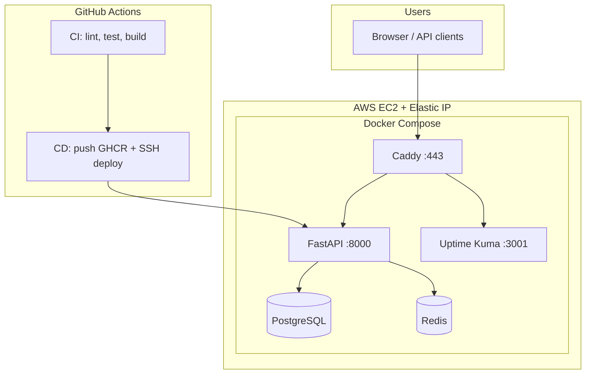

# StatusPulse

Self-hosted **status page** and **health monitoring API** with production deployment on AWS (free tier), Docker, Terraform, CI/CD (GitHub Actions + GHCR), Caddy HTTPS, and Uptime Kuma.

**Live URLs (configure DNS to your Elastic IP):**

| Service | URL |
|---------|-----|
| API + docs | https://statuspulse.umehta.xyz |
| Health | https://statuspulse.umehta.xyz/health |
| Uptime Kuma | https://statuspulse-kuma.umehta.xyz |

---

## Architecture



---

## Repository structure

```
statuspulse/
├── .github/workflows/     # ci.yml, deploy.yml
├── app/                   # FastAPI application (do not modify for assessment)
├── caddy/                 # Caddyfile.tpl → generated Caddyfile on deploy
├── scripts/
│   ├── bootstrap.py       # Terraform + first production deploy
│   ├── deploy.sh          # GHCR pull, zero-downtime, rollback
│   ├── backup.sh          # PostgreSQL backup + rotation
│   ├── health-monitor.sh  # Cron: health, disk, memory, TLS
│   └── install-cron.sh    # Install cron entries on server
├── terraform/             # AWS IaC (EC2, EIP, SG)
├── tests/
│   └── test_integration.sh
├── screenshots/           # Assessment proof screenshots
├── Dockerfile             # Multi-stage, non-root, <200MB
├── docker-compose.yml     # Local dev (app + postgres + redis)
├── docker-compose.prod.yml
├── Makefile
├── .env.example
├── README.md
└── SECURITY.md
```

---

## Prerequisites

| Tool | Purpose |
|------|---------|
| Docker + Compose | Local dev & production |
| Terraform >= 1.0 | AWS infrastructure |
| AWS CLI | Credentials |
| Python 3.9+ | `bootstrap.py` |
| GitHub account | CI/CD + GHCR |

---

## Task 1 — Run locally

```bash
cp .env.example .env
# Edit passwords in .env

make build
make up
make test          # curl /health — all checks healthy
make logs
make down
make clean         # remove volumes
make shell         # bash in app container
make image-size    # verify image < 200MB
```

**Proof:** `docker compose ps` (all healthy), `make test`, `docker images` size.

---

## Task 2 — CI/CD

### CI (`.github/workflows/ci.yml`)

On every push/PR to `main`:

1. Ruff lint on `app/`
2. Hadolint on `Dockerfile`
3. Build image (< 200MB check)
4. `docker compose up` + integration tests
5. Upload artifacts

### Deploy (`.github/workflows/deploy.yml`)

After CI passes on `main`:

1. Build & push to `ghcr.io/<owner>/statuspulse:latest` and `:sha`
2. SSH to server → `deploy.sh`
3. Health check `https://$DOMAIN/health`
4. GitHub commit comment notification

### GitHub Secrets required

| Secret | Example |
|--------|---------|
| `SSH_HOST` | Elastic IP |
| `SSH_USER` | `ubuntu` |
| `SSH_PRIVATE_KEY` | Contents of `~/.ssh/id_ed25519` |
| `DOMAIN_NAME` | `statuspulse.umehta.xyz` |

### Integration tests

```bash
make up
chmod +x tests/test_integration.sh
BASE_URL=http://localhost:8000 ./tests/test_integration.sh
```

---

## Task 3 — Production deploy

### First-time (Terraform + stack)

```bash
# 1. Edit terraform/terraform.tfvars (domain, VPC, SSH key)
# 2. Bootstrap everything
cd scripts
python3 bootstrap.py
```

Bootstrap: Terraform apply → Elastic IP → userdata (Docker, UFW, SSH harden) → rsync stack → `docker-compose up`.

### Updates via CI/CD

Push to `main` → CI → deploy workflow → `scripts/deploy.sh` on server.

### Manual deploy on server

```bash
export APP_IMAGE=ghcr.io/YOUR_ORG/statuspulse:latest
export DOMAIN_NAME=statuspulse.umehta.xyz
cd /opt/statuspulse && ./deploy.sh
```

`deploy.sh`: pull image → recreate app → health check → **rollback** previous image on failure. Logs: `/var/log/statuspulse-deploy.log`.

### DNS

| Host | Type | Value |
|------|------|-------|
| `statuspulse.umehta.xyz` | A | Elastic IP |
| `statuspulse-kuma.umehta.xyz` | A | Elastic IP |

---

## Task 4 — Monitoring & alerting

### Uptime Kuma

- URL: **https://statuspulse-kuma.umehta.xyz**
- First visit: create admin user
- Add monitors (assessment):

| Monitor | Type | Target |
|---------|------|--------|
| StatusPulse health | HTTP(s) | `https://statuspulse.umehta.xyz/health` every 60s |
| PostgreSQL | TCP | `statuspulse-postgres:5432` (or server IP if exposed) |
| Redis | TCP | internal / port 6379 |
| TLS certificate | HTTP(s) or dedicated | Your domain |

Enable **public status page** in Kuma settings.

### Alert channels

Configure **2+** in Uptime Kuma (Slack, Discord, Telegram, email, Ntfy.sh). Demo: stop app container → alert → start → recovery.

### Health monitor cron

On server:

```bash
export DOMAIN_NAME=statuspulse.umehta.xyz
export ALERT_WEBHOOK_URL=https://your-webhook   # Slack/Discord/Ntfy
chmod +x /opt/statuspulse/health-monitor.sh
./scripts/install-cron.sh   # or add crontab manually
```

Log: `/var/log/statuspulse-monitor.log` (every 5 min).

---

## Task 5 — Infrastructure as Code & backups

### Terraform

See [terraform/README.md](terraform/README.md).

```bash
cd terraform && terraform apply
terraform output server_ip
```

### Backups

```bash
# On server
/opt/statuspulse/backup.sh
# Cron: daily 02:00 — install-cron.sh
```

Files: `/opt/statuspulse/backups/statuspulse_db_*.sql.gz` (keep 7).

Restore:

```bash
gunzip -c backups/statuspulse_db_YYYY-MM-DD_HHMMSS.sql.gz | \
  docker-compose exec -T postgres psql -U statuspulse statuspulse
```

Optional S3: set `S3_BUCKET` + AWS CLI on server.

---

## Task 6 — Security

See [SECURITY.md](SECURITY.md).

```bash
# Scan image
docker build -t statuspulse:scan .
trivy image statuspulse:scan

# Headers
curl -sI https://statuspulse.umehta.xyz/

# Rate limit demo
for i in $(seq 1 120); do curl -s -o /dev/null -w "%{http_code}\n" https://statuspulse.umehta.xyz/health; done
```

---

## API reference

| Method | Path | Description |
|--------|------|-------------|
| GET | `/` | Service info |
| GET | `/health` | API + DB + Redis health |
| GET | `/docs` | Swagger UI |
| POST | `/services` | Register service |
| GET | `/services` | List services |
| POST | `/incidents` | Create incident |
| GET | `/incidents` | List incidents |

---

## Troubleshooting

| Issue | Fix |
|-------|-----|
| Port 80 in use | `sudo systemctl stop caddy` (host Caddy vs Docker) |
| `docker compose` vs `docker-compose` | Server uses `docker-compose` (Ubuntu package) |
| HTTPS not ready | Wait for DNS + Let's Encrypt (minutes) |
| Caddy `rate_limit` error | Use `caddy:2.9-alpine` or remove `rate_limit` block |
| rsync permission denied | `sudo chown -R ubuntu:ubuntu /opt/statuspulse` |
| Deploy rollback | Check `/var/log/statuspulse-deploy.log` |

---

## Assessment checklist

- [ ] Public GitHub repo
- [ ] Live HTTPS `/health` and `/docs`
- [ ] Uptime Kuma public status page
- [ ] 3+ green CI runs + 1 failed run screenshot
- [ ] GHCR images with SHA tags
- [ ] Screenshots in `screenshots/`
- [ ] `SECURITY.md` + Trivy before/after
- [ ] `crontab -l` for monitor + backup

---

## License

Internal / assessment submission.
